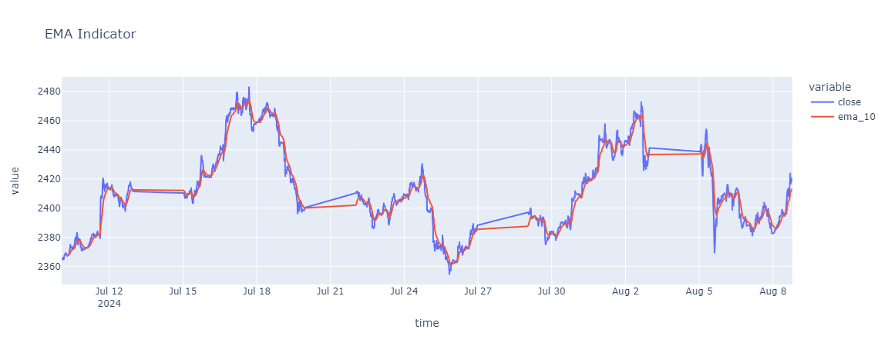
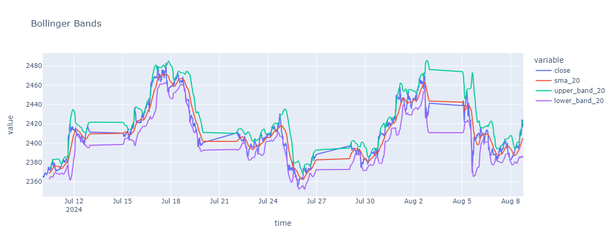
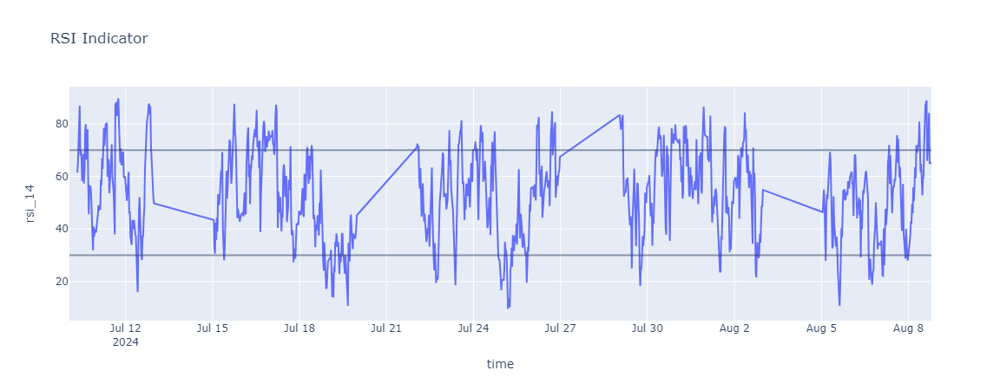

# Gold Price Prediction Using 30-Minute Candlestick Data

## Project Overview

This project is focused on predicting the price movement of gold (XAUUSD) using 30-minute candlestick data. By calculating and analyzing various financial indicators, we aim to predict whether the price will go up, down, or remain neutral in the next 30-minute interval. The core of the project involves feature engineering, where data is split into windows of six candles, and predictions are made using a machine learning model, several models are teste thorougout the project.

## Table of Contents

1. [Project Structure](#project-structure)
2. [Installation](#installation)
3. [Part 1: Technical Indicators Exploration](#part-1-technical-indicators-exploration)
4. [Part 2: Gold Price Prediction](#part-2-gold-price-prediction)
   - [Data Acquisition](#data-acquisition)
   - [Feature Engineering](#feature-engineering)
   - [Modeling](#modeling)
   - [Evaluation](#evaluation)
   - [Results](#results)
5. [Contributing](#contributing)
6. [License](#license)

## Project Structure

- **`indicators.ipynb`**: A notebook dedicated to the calculation, visualization, and exploration of various technical indicators.
- **`main.ipynb`**: The primary notebook containing the full workflow, from data acquisition to model evaluation.
- **`requirements.txt`**: Needed libraries for the project.
- **`src/`**: Example pics

## Installation

To run the notebooks, you need to have Python and the necessary libraries installed. You can install the required packages using:

```bash
pip install -r requirements.txt
```
## Part 1: Technical Indicators Exploration
The indicators.ipynb notebook is dedicated to the definition, calculation, and visualization of various technical indicators. This notebook serves as a reference for understanding how each indicator works and how it is computed.

### Indicators Covered:
1. Simple Moving Average (SMA)
2. Exponential Moving Average (EMA)
3. Average True Range (ATR)
4. Relative Strength Index (RSI)
5. High/Low of Previous Session
6. Standard Deviation
7. Bollinger Bands
8. Moving Average Convergence/Divergence (MACD)
9. SMA Crossover
10. Stochastic Oscillator

### Usage
Each indicator is calculated and plotted against the price data to show its behavior and potential signals for trading. This exploration helps in selecting the most relevant indicators for the prediction model.

Some Examples:


<p align="center"><em>Figure 1: EMA indicator on gold chart.</em></p>


<p align="center"><em>Figure 2: Bollinger Bands indicator on gold chart.</em></p>


<p align="center"><em>Figure 3: RSI indicator on gold chart.</em></p>

## Part 2: Gold Price Prediction
### Data Acquisition
The data is retrieved directly from MetaTrader 5 (MT5) using the MetaTrader5 Python package. The notebook logs into the MT5 platform, retrieves historical OHLC (Open, High, Low, Close) data for the gold (XAUUSD) symbol on a 30-minute timeframe, and loads it into a Pandas DataFrame.


### Feature Engineering

#### Broker-Provided Features

In addition to the calculated indicators and features, the broker (MetaTrader 5) provides us with the following essential features for each candle:

1. **Open**: 
   - The opening price of the candle.
   
2. **High**: 
   - The highest price reached during the candle.

3. **Low**: 
   - The lowest price reached during the candle.
   
4. **Close**: 
   - The closing price of the candle.

5. **Volume**: 
   - The tick volume, representing the number of price changes during the candle. It is an indicator of market activity during that period.


The data is structured into windows of six candles, where each window's features are used to predict the movement of the next candle. This means that the features for a prediction include the prices, volumes, and calculated indicators from the previous six 30-minute intervals.

In addition to the technical indicators, two important features are calculated:

1. **Change**: 
   - The `change` feature represents the difference in closing price between the current candle and the previous candle. This is calculated as:
     ```python
     df['change'] = df['close'] - df['open']
     ```
   - This feature helps to capture the short-term momentum in price movements.

2. **Label**: 
   - The `label` feature is the target variable used for training the model. It indicates the direction of the price movement in the next candle. The label is calculated as:
     ```python
      gold.loc[gold['change'] >= 0.7, 'label'] = 1
      gold.loc[gold['change'] < 0.7, 'label'] = 0
      gold.loc[gold['change'] <= -0.7 , 'label'] = -1
     ```
   - Here, `1` indicates an upward movement, `-1` indicates a downward movement, and `0` indicates no change.

### Modeling

Several machine learning models were tested, with the **Random Forest Classifier** selected as the final model due to its performance. The model uses the features from the previous six candles to predict whether the price will move up, down, or stay neutral in the next candle.

### Evaluation

The Random Forest model achieved the following metrics:

- **Overall Accuracy**: 60%
- **Accuracy for Buy Orders**: 65%

These results indicate that the model is particularly effective at predicting upward movements, which can be valuable for making buy decisions.

### Results

- The model's performance was evaluated using accuracy metrics and confusion matrix visualizations.
- The achieved accuracy of 60% shows a promising ability to predict short-term price movements, especially for buy orders where the accuracy reached 65%.
- The notebook discusses potential improvements and next steps for further enhancing model performance.

## Disclaimer

This project is just a simple exploration of gold price prediction using technical indicators and some made up techniques. It is important to note that the model developed in this project may not be accurate, with an overall accuracy for all situations. This project serves primarily as an educational and exploratory tool rather than a robust trading system.

it is intended purely for learning and experimentation purposes, and it is not suitable for real-world trading or investment strategies.

## License

This project is licensed under the MIT License. See the [`LICENSE`](LICENSE) file for more details.
